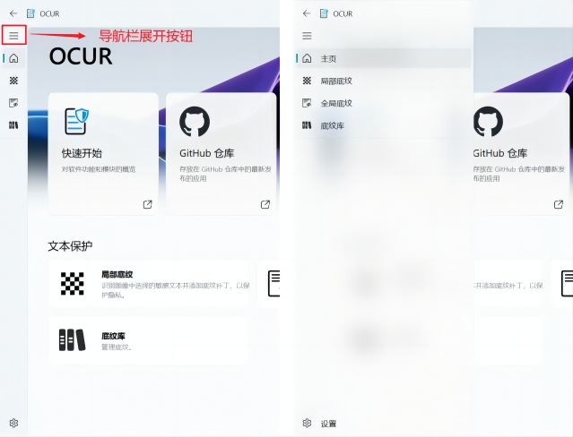
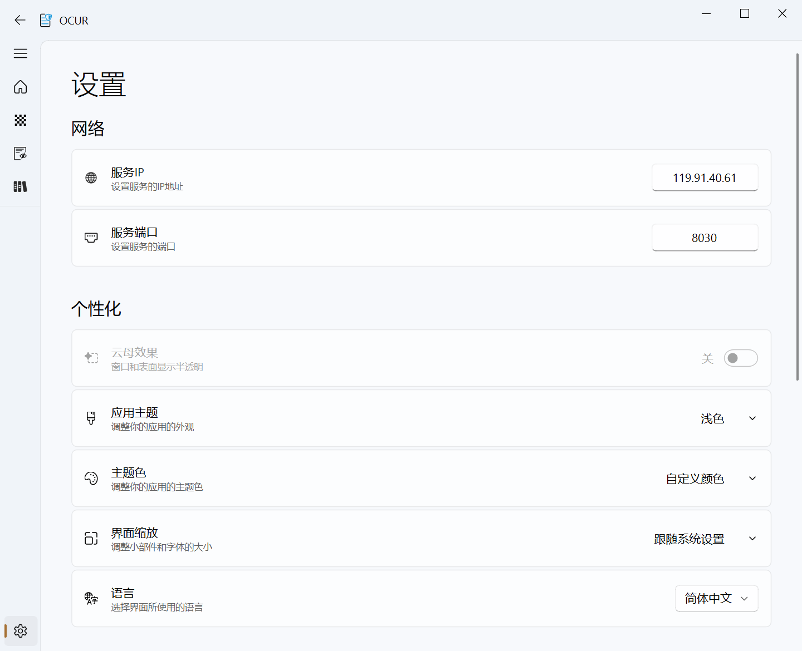

开发本系统的客户端界面 UI 时，我们采用了现代化的设计理念，以提供清晰、直观且美观的用户体验。客户端界面不仅重视功能的实用性和访问性，也注重视觉的吸引力和操作的直观性。主要界面包括主页、部分底纹、全局底纹和底纹库，每个部分都经过精心设计，以满足不同用户的操作需求。

##  主页

主页是用户首次进入系统时看到的界面，设计上我们强调简洁性和功能性。

主页布局清晰，主要分为上下两个区域。

上方的链接区域一共提供了四个链接卡片，点击后分别跳转到 OCUR 官网的快速开始页面、Github 代码仓库、OCUR 官网的用户手册页面以及用户反馈页面。

下方区域提供了三个快速访问卡片，点击后可以路由到主要功能的界面。

## 局部底纹

在“局部底纹”界面中，用户可以选择特定区域并应用不同的底纹效果。

局部底纹的 UI 界面主要分为了4大区域：**图像浏览窗**、**文本列表**、**底纹选择区域**和**模型选择区域**。

图像浏览窗区域使用了 QGraphicsView 配合自定义的GraphScene来展示用户上传的图片。用户可以通过图形界面直观地查看和操作图片，包括缩放和拖动查看不同部分。QPainter.Antialiasing 的高效渲染确保图像在编辑过程中保持高质量的显示。

文本列表区域展示了图片中识别出的文本条目，用户可以在这里选择特定的文本进行底纹应用。

用户可以在底纹选择区域选择预定义的通用底纹样式或自己训练的底纹样式。除了样式，用户还能够自主选择底纹的强度，底纹强度分别有4个级别：25% , 50% , 75%和100%。这一功能增加了软件的灵活性，允许用户根据具体需求定制底纹效果，从而增强图片的保护或视觉效果。

在模型选择区域，用户可以根据自己的需求选择相应的主流OCR服务的模型。通过对比不同模型的测试结果，用户可以比较出效果最好的底纹。

## 全局底纹

“全局底纹”界面允许用户在整张图片上应用统一的底纹效果。这适用于希望快速完成底纹覆盖的用户。界面设计简洁，操作直观，支持预览功能，用户可以即时看到底纹应用的效果，确保选择的底纹在视觉效果上符合自己的要求。

相比于局部底纹界面，全局底纹的将文本列表区域换成了图像列表，这使得用户能够批量上传并处理图像，同时快速切换希望预览的图像。

 

## 底纹库

“底纹库”界面是管理用户底纹集合的地方。用户可以浏览所有可用的底纹，进行添加、删除或编辑操作。此界面设计的目标是使底纹管理尽可能直观和高效，支持批量操作功能，同时允许用户上传自己的训练图片以生成更加有针对性和高效的底纹。

 

## 导航栏

导航栏是系统的核心导航界面，为用户提供快速访问系统各个部分的功能。

导航栏通过 NavigationAvatarWidget 和 NavigationItemPosition 类的使用，实现了功能模块的高效组织。此外，系统还根据用户的操作系统版本启用了 Mica 效果，增强视觉体验。导航项通过 addSubInterface 方法添加，每个子界面都与一个图标和文本标签相关联，确保用户可以直观地识别各个功能。

导航栏也可以通过点击上方的展开按钮后展开，此时每一个功能图标旁会显示该功能的具体名称，方便用户更清晰地根据需求跳转到对应功能界面。

## 设置界面

设置界面为用户提供了丰富的个性化选项，以优化和定制软件的使用体验。下面是设置界面的主要设置项：

| **设置项**          | **功能描述**                                                 |
| ------------------- | ------------------------------------------------------------ |
| **服务 IP 和端口**        | 允许用户通过设置服务端的 IP 和端口，进而使用自行搭建的服务端系统。 |
| **Mica 效果**        | 允许用户开启或关闭 Mica 效果，这种效果会应用半透明纹理到窗口和表面上，仅在 Windows 11上可用。 |
| **应用主题**        | 用户可以选择“浅色”、“深色”或“系统设置”，改变应用的整体外观。 |
| **语言**            | 允许用户选择界面语言，如简体中文和英语。                 |
| **主题色彩**        | 提供一个颜色选择器，用户可以自定义界面的主题色。         |
| **界面缩放**        | 提供不同的缩放比例选项，如100%、125%等，以及使用系统设置。 |
| **Acrylic模糊半径** | 用户可以调整模糊效果的半径，这影响透明效果的强度。       |
| **启动时检查更新**  | 用户可以设置软件启动时是否自动检查更新，确保使用的是最新版本。 |

